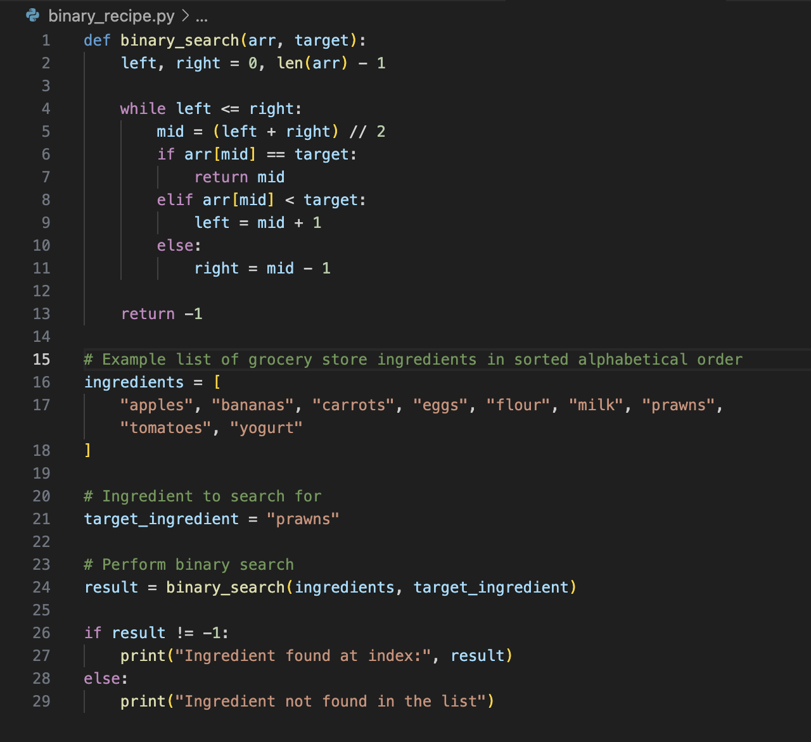

# Jesse_Prpic_T2_A1-B

## Question 1
### Identify and explain the workings of TWO sorting algorithms and discuss and compare their performance / efficiency (i.e Big O)

<!-- What is sorting algorithm in general -->
<!-- quick introduction of sorting algorithm and introduce the two sorting algorithms -->

<!-- What is sorting algorithm 1 -->
Within computer science, algorithms play a fundamental role 
<!-- How does it work -->
<!-- Where is it used -->
<!-- Example of code of this algorithm 1 -->
<!-- Benefits and cons of algorithm 1 -->

<!-- What is sorting algorithm 2 -->

<!-- How does it work -->
<!-- Where is it used -->
<!-- Example of code of this algorithm 2 -->
<!-- Benefits and cons of algorithm 2 -->

<!-- What is sorting algorithm 2 -->
<!-- How does it work -->
<!-- Where is it used -->
<!-- Example of code of this algorithm 2 -->
<!-- Benefits and cons of algorithm 2 -->

<!-- Comparison of each -->
<!-- Summary of both  -->

## Question 2

### Identify and explain the workings of TWO search algorithms and discuss and compare their performance/efficiency (i.e Big O)

<!-- What is search algorithm in general -->
Imagine you need to find a specific recipe in an online directory. You could use different search algorithms to find it, and choosing the right one depends on the situation. Let’s compare Linear Search and Binary Search in this context.

Linear Search is a simple algorithm that scans through each element of a list sequentially, from the start to the end, to find the desired item. It doesn’t require the list to be sorted. Here’s how it would work with your recipe example:
Process: If you're searching for a recipe involving prawns, Linear Search will start at the beginning of the directory and check each recipe one by one until it finds the one with prawns or reaches the end of the list.
Efficiency: If the recipe you're looking for happens to be near the start of the list, Linear Search will be quite efficient. However, if it's near the end, it will take longer because the algorithm may need to check many items before finding the desired recipe. 
(Binary Search vs. Linear Search – Differences with Examples, 2023)

Use Cases: Linear Search is ideal for small or unsorted lists. It’s straightforward to implement and doesn’t require sorting the data. This makes it useful when you have a small collection of recipes or when the list is unordered (CodeChuckle, 2024).

An example of the code based on this scenario would be;

)) ./liner_recipe.png

This algorithm has both advantages and drawbacks. One major drawback is its time complexity of O(n), which means it can be slow for large lists because it may need to check every element in the worst-case scenario (OpenGenus Foundation, 2023). Additionally, performing multiple searches can be cumbersome, as Linear Search does not offer optimization for frequent or repeated searches. These factors contribute to Linear Search being less efficient and not ideal for performance-critical applications or large datasets (OpenGenus Foundation, 2023).

Linear Search is particularly effective for small lists or simple datasets, where the overhead of more complex algorithms might not be justified. Its consistent performance, regardless of the element order, ensures a predictable search process. Additionally, its versatility allows it to be applied to various data structures, such as arrays and linked lists, without requiring prior sorting of the data, unlike Binary Search (GeeksForGeeks, 2023).

<!-- What is search algorithm 2 -->
Binary Search is a more efficient algorithm for sorted lists, employing a "divide and conquer" approach. It repeatedly divides the search interval in half, which significantly speeds up the search process for large datasets (Nibesh Khadka, 2024).
Unlike Linear Search, this algorithm is required to be sorted; here’s how it would work with the recipe example:

Process: if you were searching for a specific recipe in a sorted directory of recipes, Binary Search would start by checking the middle recipe. 

Efficiency: The time complexity of Binary Search is 0(log n), this means that the algorithm is much faster for larger and sorted lists, it significantly reduces the number of iterations of comparisons compared to Linear Search (Codecademy, n.d.).

Use case: Based on the example of searching for prawns in a recipe; as "p" is the 16th letter in the alphabet, the algorithm would find the middle of the dataset and search either the left or right half of the list (Agarwal, 2021). In this example with 26 letters, the middle being the 13th letter (m), it would search to the right of the list and repeat halving the search. This halving process continues until the desired recipe is found or the search interval is empty, making the search much faster compared to a Linear Search (Agarwal, 2021).

An example of this code would be;

Similar to linear search; binary search also offers advantages and drawbacks. By having the time complexity of O(log)n, this makes the efficicency of the search much more supreme with large and sorted data as it can zero in on the taget value. However, although having the efficency supreme with a large sorted this; the drawback is that this list requires to be sorted before performing the search which means that it can also be more complex to implement due to the complex nature of the algorithm (Codedamn, 2023).

In conclusion; the two algorithms are base on their time complexity and the restraints on how their efficiency is on the type of dataset that is implementsl; whether it is sorted or unsorted.
If your list of recipes is small or unsorted, Linear Seach is a simple and effective choice; however if your dataset is going to be a bit more complex, larger and sorted binary is the more efficient alternative.

To understand a visual representation of these two in action, see the below;

./binary_vs_linear )) 

### Bibliography

Binary Search vs. Linear Search – Differences with examples. (2023, April 2). Codedamn News. https://codedamn.com/news/algorithms/optimizing-search-algorithms-binary-vs-linear

CodeChuckle. (2024, February 15). Understanding Linear Search Algorithm: A Beginner’s Guide. Medium. https://medium.com/@codechuckle/understanding-linear-search-algorithm-a-beginners-guide-d51d07b67aab

OpenGenus Foundation. (2023). Advantages and disadvantages of linear search. OpenGenus IQ.

What is Linear Search? (2023, March 13). GeeksforGeeks. https://www.geeksforgeeks.org/what-is-linear-search/

Nibesh Khadka. (2024, April 8). What is a Binary Search Algorithm? How does Big O Notation work? Medium; Script Portal. https://medium.com/script-portal/what-is-a-binary-search-algorithm-how-does-big-o-notation-work-c93da4a74273#:~:text=A%20binary%20search%20is%20significantly

Codecademy. (n.d.). Searching arrays in Java: Cheatsheet. Codecademy. https://www.codecademy.com/learn/linear-data-structures-java/modules/searching-arrays-java/cheatsheet

Agarwal, P. (2021, August 30). What is a binary search algorithm? How does Big O notation work? Medium. https://medium.com/script-portal/what-is-a-binary-search-algorithm-how-does-big-o-notation-work-c93da4a74273

Codedamn. (2023, July 25). Optimizing search algorithms: Binary vs. linear. Codedamn. https://codedamn.com/news/algorithms/optimizing-search-algorithms-binary-vs-linear